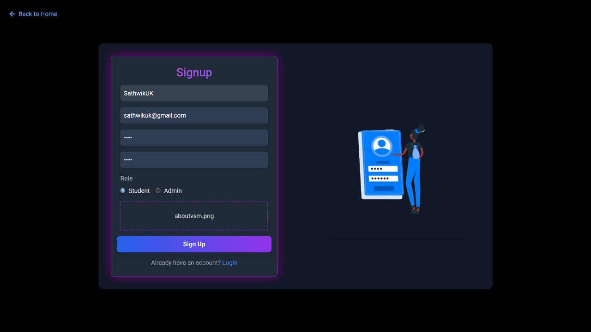
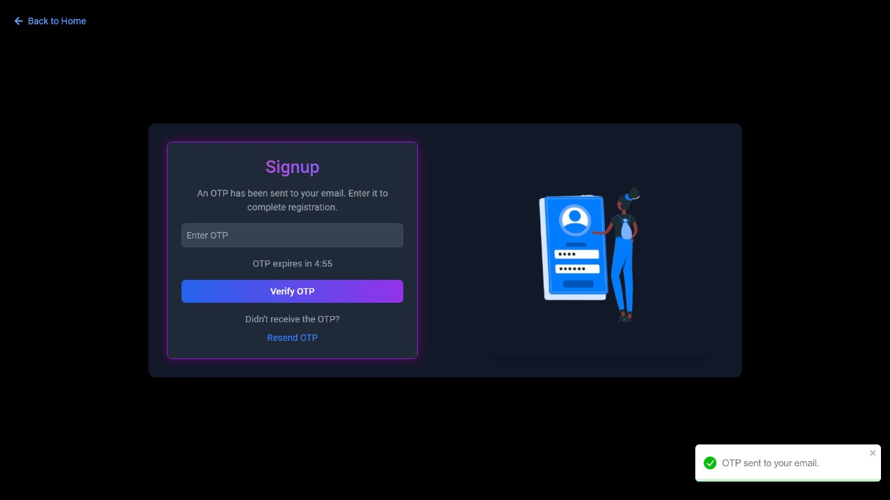
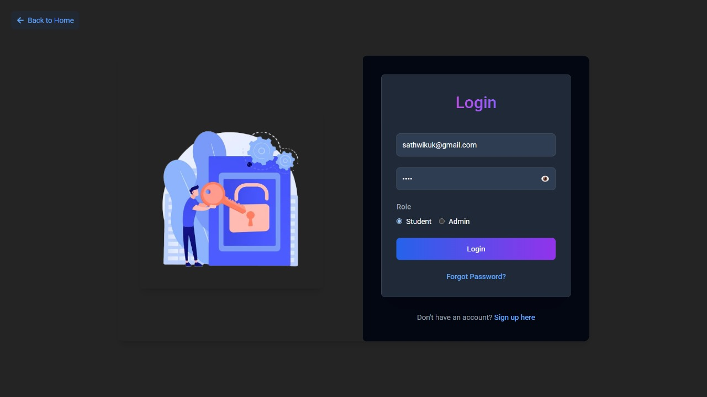

<div align="center" style="background-color: #0B0014; color: #C87CFF;">

# ⚡ Virtual Study Mugen (VSM)

<p align="center">
  
</p>

<p style="color: #E58CFF;">
A collaborative study platform where students can chat with peers, form study groups, and engage in interactive learning sessions. The platform features a role-based system that distinguishes between admin and student users, ensuring a secure and organized environment for all participants.
</p>

</div>

## 🚀 Tech Stack

<table>
  <tr>
    <td align="center" width="120">
      
      <br>Express
    </td>
    <td align="center" width="120">
      
      <br>MongoDB
    </td>
    <td align="center" width="120">
      
      <br>Node.js
    </td>
    <td align="center" width="120">
      
      <br>React
    </td>
  </tr>
  <tr>
    <td align="center" width="120">
      
      <br>JWT
    </td>
    <td align="center" width="120">
      
      <br>Nodemailer
    </td>
    <td align="center" width="120">
      
      <br>Socket.io
    </td>
    <td align="center" width="120">
      
      <br>OpenAI
    </td>
  </tr>
</table>

## ✨ Features

<div style="background-color: #1f0126; padding: 20px; border-radius: 10px;">

- ⚡ **RESTful API** — Well-structured endpoints for seamless integration
- 🔐 **Role Based Login** — Secure login system with distinct roles for admin and student
- 📱 **Responsive Design** — Optimized for a range of devices and screen sizes
- 💬 **Real-time Chat** — Connect and collaborate instantly
- 👥 **Group Creation** — Form study groups effortlessly
- 🛠 **Admin Panel** — Manage users and content efficiently

</div>

## 🛠️ Setup & Installation

<div style="background-color: #1f0126; padding: 20px; border-radius: 10px;">

1. **Clone the repository**
   ```bash
   git clone https://github.com/Somepalli-Venkatesh/vsm.git
   ```

2. **Install dependencies**
   ```bash
   npm install
   ```

3. **Start the frontend**
   ```bash
   cd vsm/frontend
   npm install
   npm run dev
   ```

4. **Start the backend**
   ```bash
   cd vsm/backend
   npm install
   npm start
   ```

</div>

## 📸 Workflow Screenshots

<details>
<summary style="color: #C87CFF;">Click to view workflow screenshots</summary>

<p align="center">
  
  
</p>

<p align="center">
  
  
</p>

<p align="center">
  
  
</p>

<p align="center">
  
  
</p>

<p align="center">
  
  
</p>

<p align="center">
  
  
</p>

<p align="center">
  
  
</p>

<p align="center">
  
  
</p>

<p align="center">
  
  
</p>

<p align="center">
  
  
</p>

</details>

## 🌐 Live Demo

<div align="center" style="background-color: #1f0126; padding: 20px; border-radius: 10px;">
  <a href="https://dummyurl.com" target="_blank">
    
  </a>
  <p style="color: #C87CFF;">Click the image above to view the live demo</p>
</div>

## 📫 Contact

<div align="center" style="background-color: #1f0126; padding: 20px; border-radius: 10px;">
  <a href="https://instagram.com" target="_blank">
    
  </a>
  <a href="https://linkedin.com" target="_blank">
    
  </a>
  <a href="https://github.com" target="_blank">
    
  </a>
</div>

<div align="center">
  <p style="color: #C87CFF;">Made with 💜 by Virtual Study Mugen Team</p>
</div>
