<div align="center">
  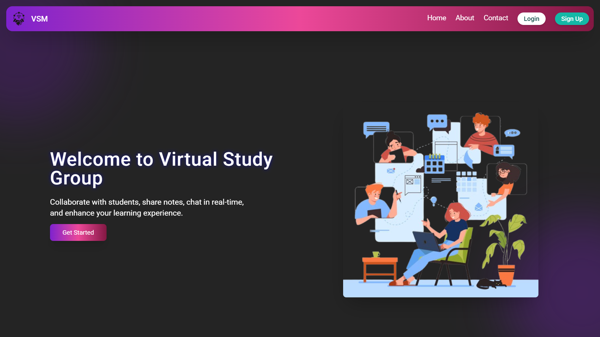

# 👨‍💻 Virtual Study Mugen (VSM💌)
 Virtual Study Mugen (VSM) is a collaborative study platform that empowers students to communicate effectively through real-time messaging and seamless file sharing. It enables users to exchange notes, documents, and study materials effortlessly, fostering an engaging learning environment where students can also form study groups. With a robust role-based system that clearly distinguishes between admin and student users, VSM ensures a secure, organized space for academic collaboration and resource sharing.
</div>

## 🧑‍🔧 Tech Stack

<table align="center">
  <tr>
    <td align="center" width="110">
      
      <br><strong>Express</strong>
    </td>
    <td align="center" width="110">
      
      <br><strong>MongoDB</strong>
    </td>
    <td align="center" width="110">
      
      <br><strong>Node.js</strong>
    </td>
    <td align="center" width="110">
      
      <br><strong>React</strong>
    </td>
  </tr>
  <tr>
    <td align="center" width="110">
      
      <br><strong>JWT</strong>
    </td>
    <td align="center" width="110">
      
      <br><strong>Nodemailer</strong>
    </td>
    <td align="center" width="110">
      
      <br><strong>Socket.io</strong>
    </td>
    <td align="center" width="110">
      
      <br><strong>OpenAI</strong>
    </td>
  </tr>
</table>

## ✨ Features

- ⚡ **RESTful API** — Well-structured endpoints for seamless integration
- 🔐 **Role Based Login** — Secure login system with distinct roles for admin and student
- 📱 **Responsive Design** — Optimized for a range of devices and screen sizes
- 💬 **Real-time Chat** — Connect and collaborate instantly
- 👥 **Group Creation** — Form study groups effortlessly
- 🛠 **Admin Panel** — Manage users and content efficiently
- 🎨 **Custom Themes** — Personalize your study environment with unique purple-inspired themes
- 🤖 **AI Assistance** — Leverage OpenAI integrations for enhanced learning and support

## 🛠 Setup & Installation

1. **Clone the repository**
```bash
git clone https://github.com/Somepalli-Venkatesh/vsm.git
```

2. **Install dependencies for the root**
```bash
npm install
```

3. **Start the frontend**
```bash
cd vsm/frontend
npm install
npm run dev
```

4. **Set up the backend**
```bash
cd vsm/backend
npm install

# Create a .env file in the backend directory with the following content:
MONGO_URI=mongodb+srv://<username>:<password>@cluster0.example.mongodb.net/?retryWrites=true&w=majority
EMAIL_HOST=smtp.gmail.com
EMAIL_PORT=587
EMAIL_USER=your.email@gmail.com
EMAIL_PASS=your_16_digit_app_password
COHERE_API_KEY=xxxxxxxxxxxxxxxxxxxxxxxxxxxxxxxx
JWT_SECRET=your_custom_jwt_secret_key_here
FRONTEND_URL=http://localhost:3000
```

5. **Start the backend**
```bash
npm start
```

### 🗝 Environment Variables Guide:
- `MONGO_URI`: Your MongoDB Atlas connection string
- `EMAIL_HOST`: SMTP server host (smtp.gmail.com for Gmail)
- `EMAIL_PORT`: SMTP server port (587 for TLS)
- `EMAIL_USER`: Your Gmail address
- `EMAIL_PASS`: Your Gmail App Password (16-digit)
- `COHERE_API_KEY`: Your Cohere API key
- `JWT_SECRET`: Custom secret key for JWT tokens
- `FRONTEND_URL`: Frontend application URL

### 🔏 Important Security Notes:
1. Never commit your .env file to version control
2. Add .env to your .gitignore file
3. Use strong, unique values for JWT_SECRET
4. For Gmail, use App Password instead of account password
5. Keep your API keys secure

## 📸 Workflow ▶

<table>
  <tr>
    <td width="50%" align="center">
      
      <p><strong>Landing Page</strong></p>
    </td>
    <td width="50%" align="center">
      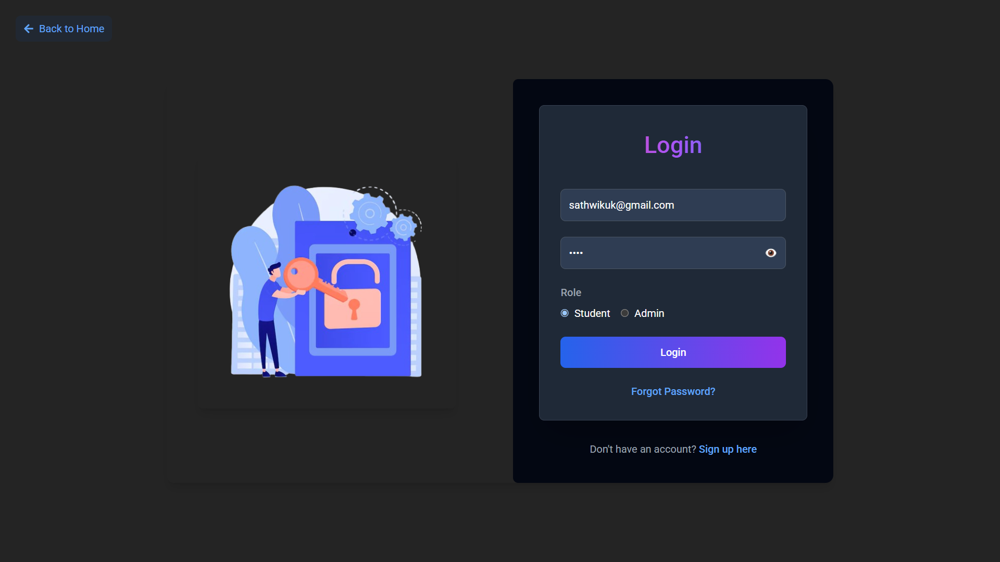
      <p><strong>Login Process</strong></p>
    </td>
  </tr>
  <tr>
    <td width="50%" align="center">
      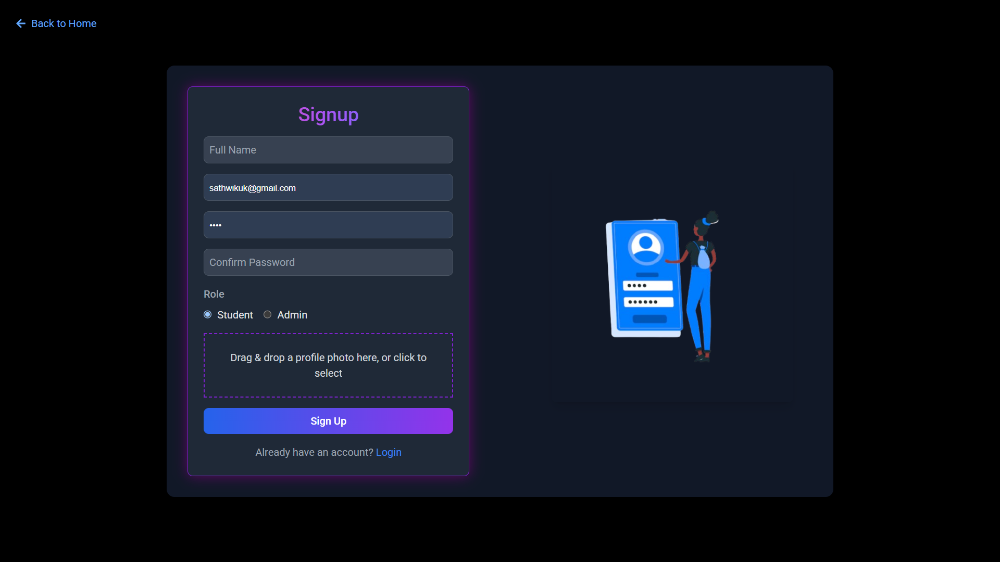
      <p><strong>Registration Page</strong></p>
    </td>
    <td width="50%" align="center">
      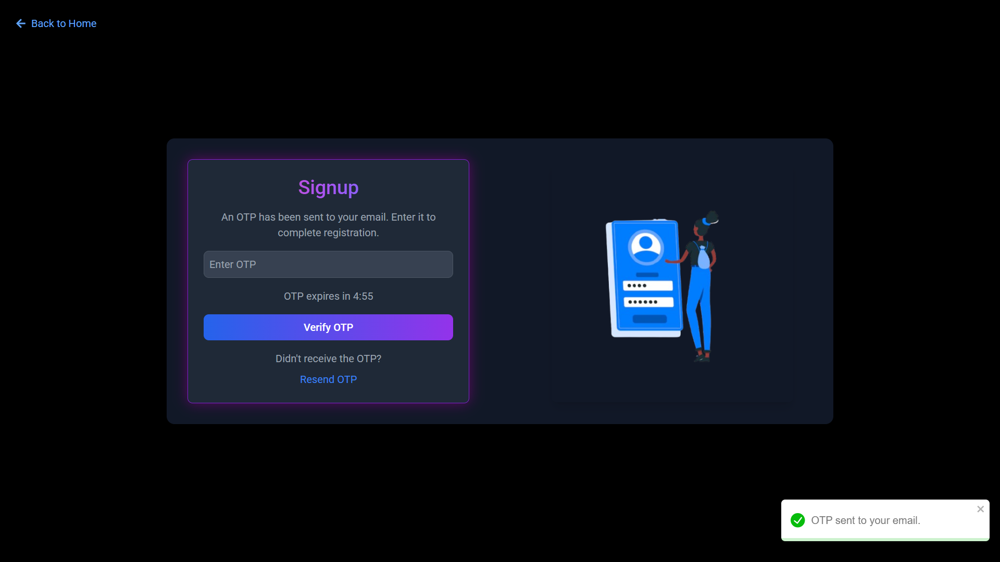
      <p><strong>OTP Verification</strong></p>
    </td>
  </tr>
  <tr>
    <td width="50%" align="center">
      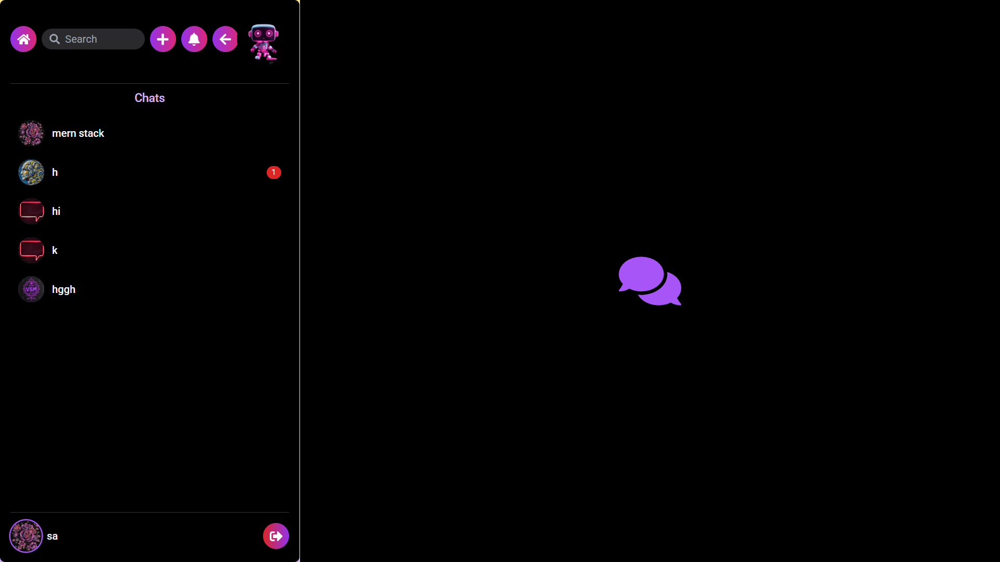
      <p><strong>User Dashboard</strong></p>
    </td>
    <td width="50%" align="center">
      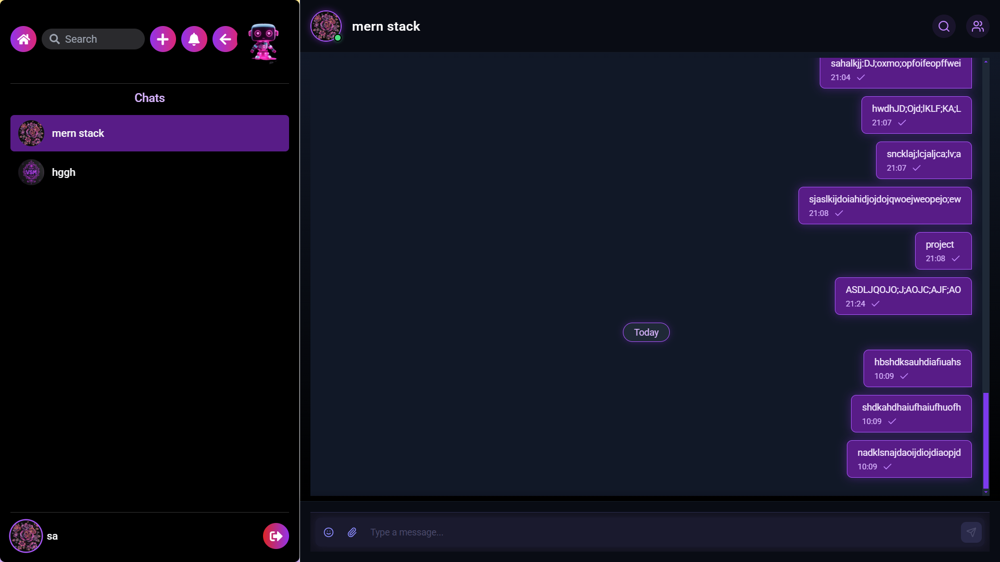
      <p><strong>Chat Section</strong></p>
    </td>
  </tr>
  <tr>
    <td width="50%" align="center">
      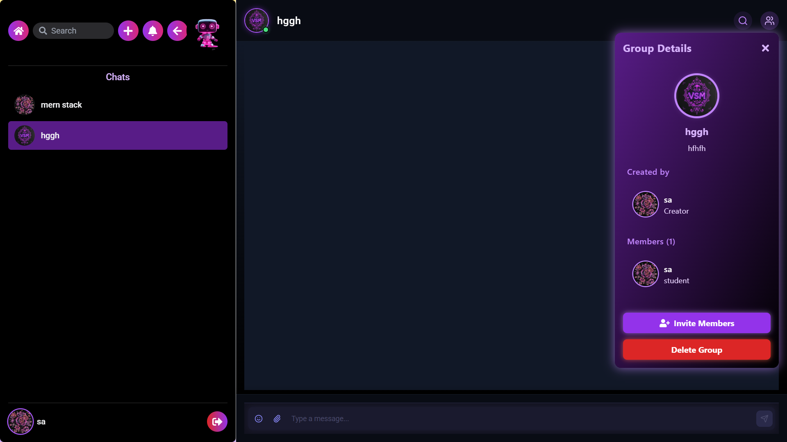
      <p><strong>Group Details</strong></p>
    </td>
    <td width="50%" align="center">
      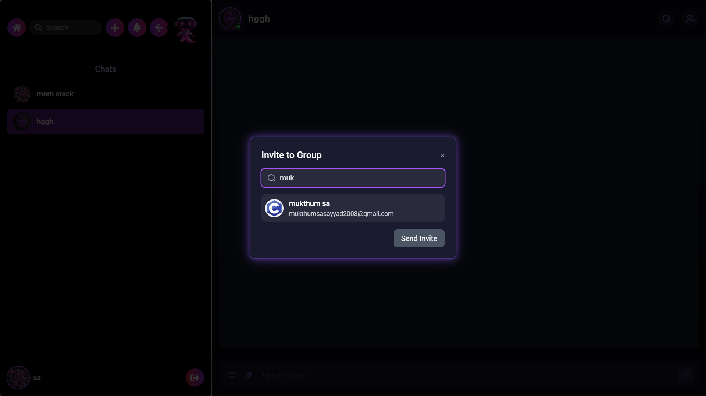
      <p><strong>Group Invitation</strong></p>
    </td>
  </tr>
  <tr>
    <td width="50%" align="center">
      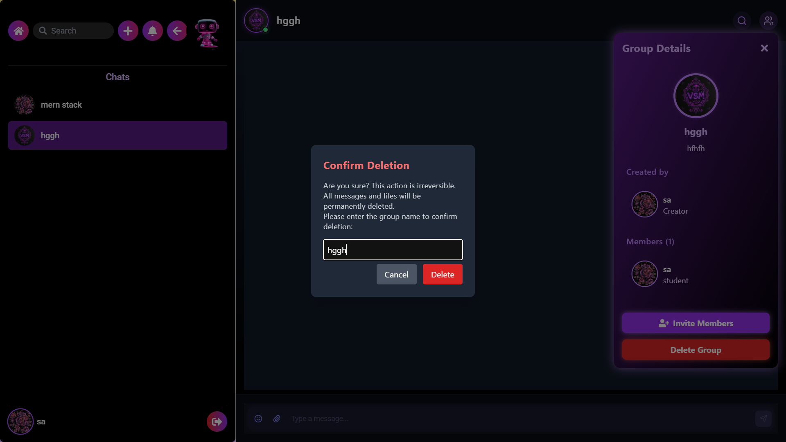
      <p><strong>Deleting Group</strong></p>
    </td>
    <td width="50%" align="center">
      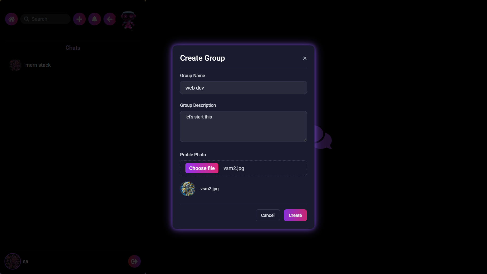
      <p><strong>Create Group</strong></p>
    </td>
  </tr>
  <tr>
    <td width="50%" align="center">
      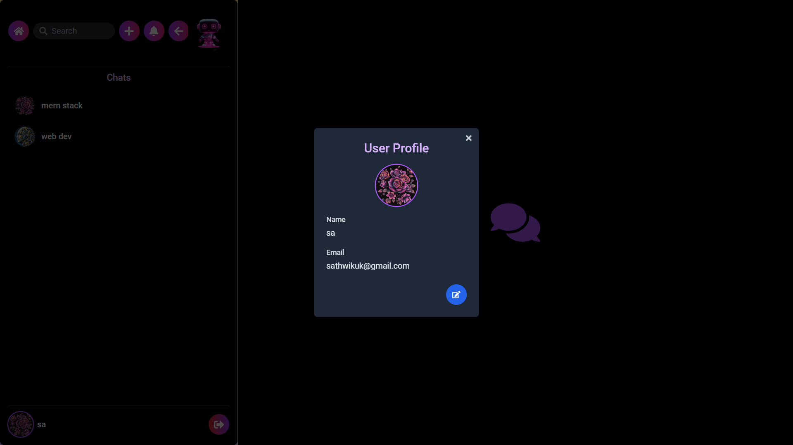
      <p><strong>User Profile</strong></p>
    </td>
    <td width="50%" align="center">
      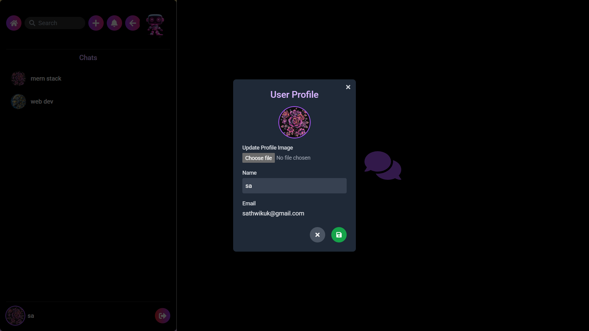
      <p><strong>Editing User Profile</strong></p>
    </td>
  </tr>
  <tr>
    <td width="50%" align="center">
      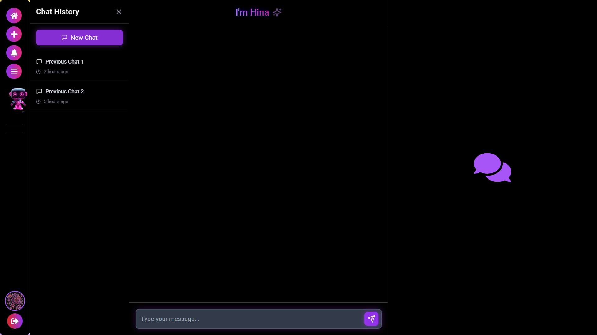
      <p><strong>Click on Robo Icon</strong></p>
    </td>
    <td width="50%" align="center">
      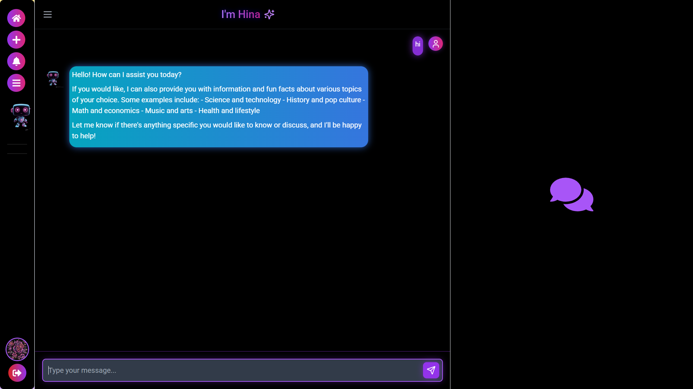
      <p><strong>Chat with Hina</strong></p>
    </td>
  </tr>
  <tr>
    <td width="50%" align="center">
      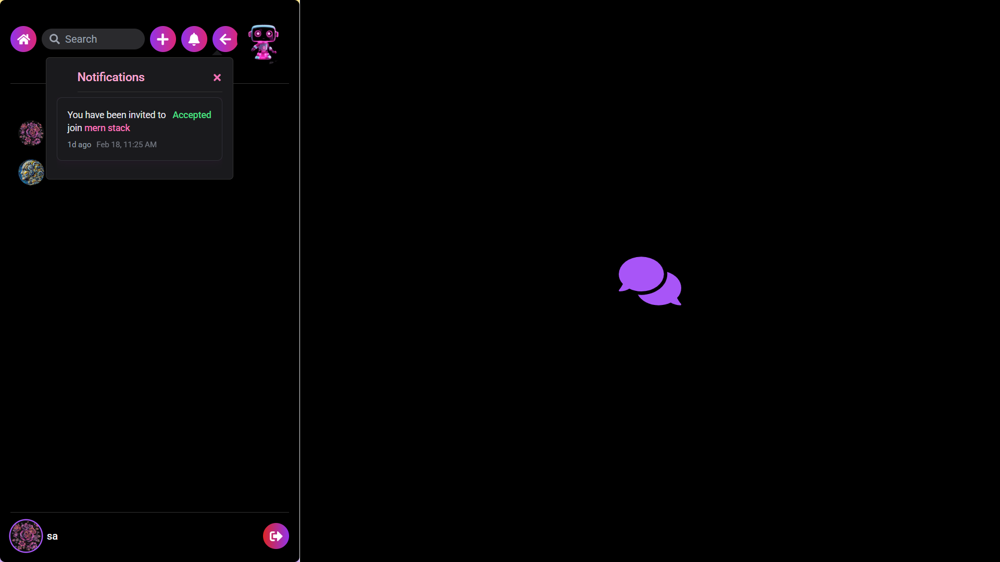
      <p><strong>Notification</strong></p>
    </td>
    <td width="50%" align="center">
      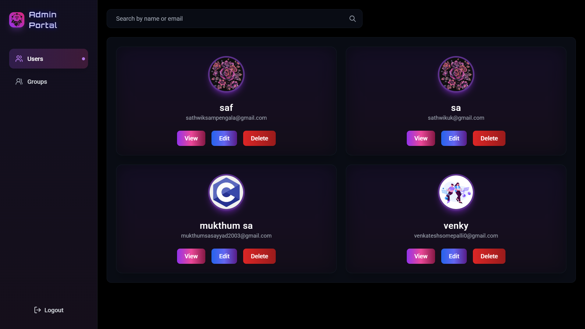
      <p><strong>Admin Dashboard-Users</strong></p>
    </td>
  </tr>
  <tr>
    <td width="50%" align="center">
      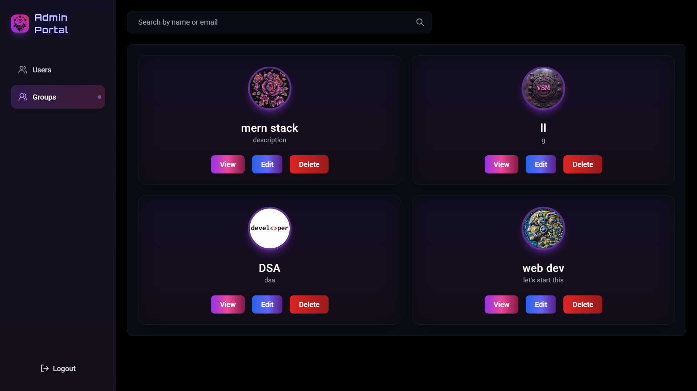
      <p><strong>Admin Dashboard-Groups</strong></p>
    </td>
    <td width="50%" align="center">
      
      <p><strong>Home</strong></p>
    </td>
  </tr>
</table>

## 🌐 Live Demo

<div align="left">
  <a href="https://vsm-virtual-study-front.vercel.app/" target="_blank">
    
  </a>
  <p><strong>Click the image above to view the live demo</strong></p>
</div>

## 📫 Contact


<div align="left">
  <a href="https://www.instagram.com/venkatesh__somepalli?utm_source=qr&igsh=ZjUyam5jdGM5aTFm" target="_blank">
    
  </a>&nbsp;&nbsp;
  <a href="https://www.linkedin.com/in/venkatesh-somepalli-84663a23b/" target="_blank">
    
  </a>&nbsp;&nbsp;
  <a href="https://github.com/Somepalli-Venkatesh" target="_blank">
    
  </a>&nbsp;&nbsp;
  <a href="mailto:somepallivenkatesh38@gmail.com" target="_blank">
    
  </a>
</div>


<div align="center">
  <h1>Made with 💜 by the Virtual Study Mugen Team</h1>
</div>


